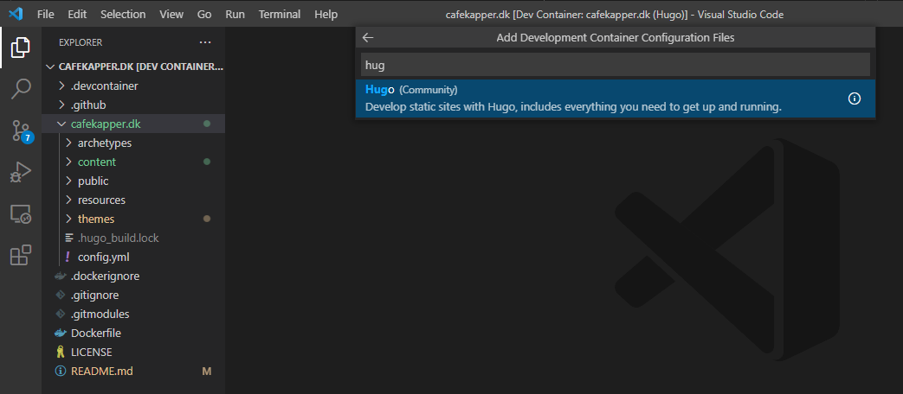
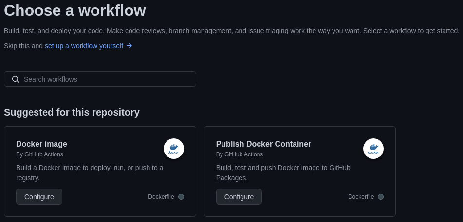

I had one primary condition when I decided to make a personal website: It must be absolutely painless to create new posts and publish them automatically through continuous integration. All I have to do is to push changes to a GitHub repository and things take care of themselves automatically.

## Bundling everything in a Docker container

Creating a simple [Docker container](https://www.docker.com/) to both serve and develop the [Hugo](https://gohugo.io/) website was my first thought. It just makes automation much easier, and it's portable so that I can work with it anywhere, and deployment is easily automated when creating new posts. I use [development containers](https://code.visualstudio.com/docs/remote/containers) through [Visual Studio Code](https://code.visualstudio.com/) quite often for scientific workflows and data science stuff (you should too), and it's straight forward to simply use a default [Hugo community](https://github.com/microsoft/vscode-dev-containers/tree/main/containers/hugo) docker image from the remote containers extension (just click `F1` -> `Add Development Container Configuration Files`), and add a few lines to the [Dockerfile](https://github.com/KasperSkytte/cafekapper.dk/blob/main/Dockerfile) to include the website.



I chose the [PaperMod](https://adityatelange.github.io/hugo-PaperMod/) theme as a start, which is included as a [git submodule](https://www.atlassian.com/git/tutorials/git-submodule). A nice feature of Hugo is that you can always change the theme without having to adjust any content. It's all markdown. The content stays the same, it's just presented differently.

Once the container is started through VSCode previewing the site is possible by running `hugo server -D` while inside the site directory (`-D` to also render drafts). New posts can be created manually as markdown files or by using a default template with `hugo new posts/newpost.md`. Hugo rebuilds the site immediately when saving a file or when any other change to the contents of the folder is detected.

## Continuous integration

Now, when the site is updated it's time to also push the changes to the repository and automatically build the container and publish it. That's just seamless with [GitHub packages](https://ghcr.io). In the GitHub repository I have placed a GitHub Actions workflow file based on the [docker-publish.yml](https://github.com/actions/starter-workflows/blob/main/ci/docker-publish.yml) template, which will automatically build a Docker container image based on the [`Dockerfile`](https://github.com/KasperSkytte/cafekapper.dk/blob/main/Dockerfile) in the root of the repo and publish it to the GitHub Container Registry (ghcr.io) as a package with every commit. Sounds fancy, but it's really simple to set up. You can either copy the template file and place it under `/.github/workflows/` or from the GitHub repository page click `Actions` -> `New workflow` -> `Publish Docker Container`.



That's it. After committing the file GitHub Actions will start the workflow immediately and after a few minutes the container is built and available for use through Docker with `docker run -p 1313:1313 ghcr.io/kasperskytte/cafekapper.dk:latest`. I had to also change the visibility to "public" in the package settings and had a few extra challenges along the way [^1].

[^1]: The build was failing repeatedly because the image couldn't be signed by cosign. Turns out it cannot handle references with any upper case letters, so I just removed it, see [this issue](https://github.com/sigstore/cosign/issues/1408). Secondly, it's also important to checkout the repository recursively in the workflow or else the PaperMod theme will not be included as it's a git submodule. Add `with: submodules: recursive` to the checkout step.

## Deploying the site automatically

While I could have made my life easier and skip all the fun container stuff and just [host the Hugo site directly on GitHub](https://gohugo.io/hosting-and-deployment/hosting-on-github/) without using containers, I wanted to be able to host the site myself and on my own domain. That was part of the reason to use a container in the first place. I had already setup an nginx reverse-proxy using the awesome [LinuxServer SWAG](https://docs.linuxserver.io/general/swag) docker image to serve all my other self-hosted services, so adding a few extra tasks to the current reverse-proxy [ansible](https://www.ansible.com/overview/how-ansible-works) role to also manage the Hugo container was simple.

```yaml
- name: "Create network swag_network"
  docker_network:
    name: swag_network
    state: present

- name: "Deploy SWAG nginx reverse-proxy container"
  docker_container:
    name: swag
    recreate: false
    restart_policy: unless-stopped
    image: ghcr.io/linuxserver/swag:latest
    published_ports:
      - 443:443/tcp
    env:
      - secret: "secret"
    networks:
      - name: swag_network
    volumes:
      - "/somewhere/swag/config:/config"
    capabilities:
      - NET_ADMIN

- name: "Deploy Hugo container with cafekapper.dk site"
  docker_container:
    name: hugo
    recreate: false
    restart_policy: unless-stopped
    image: ghcr.io/kasperskytte/cafekapper.dk:latest
    command: --baseURL https://cafekapper.dk --port 443
    networks:
      - name: swag_network


# probably a task or two here to add a reverse-proxy configuration 
# file for the new site and restart SWAG

- name: "Deploy watchtower container"
  docker_container:
    name: watchtower
    recreate: false
    restart_policy: unless-stopped
    image: containrrr/watchtower:latest
    env:
      WATCHTOWER_SCHEDULE: "0 * * * *"
    volumes:
      - "/var/run/docker.sock:/var/run/docker.sock"
    command: hugo #specific containers to watch and update+restart

# I'll spare you the rest
```

To automatically update the site with new changes I chose a simple polling solution using [watchtower](https://containrrr.dev/watchtower/) to pull the new image and restart the container with the new image at a specified polling interval, which I've set to every hour. It can also be set to poll as often as every second, but that's overkill for this purpose. If I want to publish the changes immediately I can always just run watchtower manually with `--run-once` on the server.
## Time to add some content

Now I can start adding new posts with ease and never worry about this again.
I know there are tons of other solutions out there, but this is mine and
works for my setup. I thought it would be straight forward to write the first post
about my experiences with setting up the site while fresh in mind.
